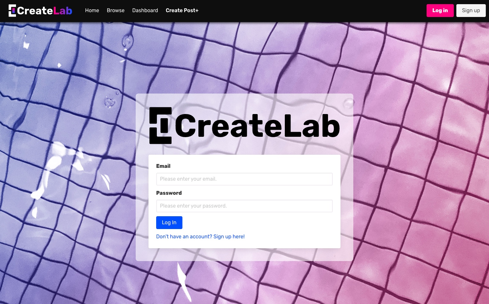

# 

## Description

Welcome to Create Lab, a vibrant artistic haven made for creatives, by creatives! Join a collective of artists seeking collaboration, critique, and an inspired community. Whether you have just started your artistic journey, or you've been creating your whole life, Create Lab is the perfect space to share your work and embark on new artistic endeavors with the help of your peers.

🎨 **Showcase Your Art:** It can be hard to find a space where you can feel comfortable sharing your art with others! Create Labs is a safe community of like-minded artists that appreiciate the beauty of all creativity. From paintings to websites, video games to ballads, your art will flourish and be celebrated here!

👥 **Connect with Like-Minded Creatives:** Build meaningful connections with fellow artists who share your passions! Exchange wisdom, discuss artistic philosophies, and collaborate on projects that transcend your own imagination. Feeling stuck? There's always someone online who might be able to help! Seeking feedback? Enhance your skills through valuable insight from our supportive community.

🌈 **Celebrate Diversity in Art:** Art is personal, so we get personal. Create Lab thrives on the diversity of its members and the unique lived experience each piece of art calls to. Embrace the rich tapestry of the world of artistic expression-- whatever your art has to say, every creative is welcome here! 

🚀 **Grow as an Artist:** Evolve and refine your skills of any niche with the guidance of a talented and creative community. Benefit from the collective insight of experienced artists and enthusiasts who are dedicated to fostering the growth and improvement of not only themselves, but YOU, too! 

*Get inspired and be inspired on Create Lab, let the collective be your muse!*

## User Story

**AS AN** aspiring creative **I WANT** a space to be able to share my works-in-progress, receive feedback and sort through creative categories **SO THAT** I am able recieve constructive feedback on my projects and collaborate with other artists to enhance and complete our art!

## Usage

• Create an account using an email, username and password. You also have the option of uploading your own profile picture!
• Login or logout using your personalized credentials.
• Make posts with descriptions, specifier tags and the ability to upload files of your work for others to see.
• Comment on other's posts to share your thoughts, critiques and ideas!
• Recieve comments from others to become inspired.
• Browse different categories to discover your niche!

## Screenshot 

## Visit our Application!

Heroku Deployment: https://project-too-82a944373894.herokuapp.com/ 
Github Repository: https://github.com/Kthao29/Project-too 

## Credits

Created by the **Lab Tech Team** using Node.js, Express.js, mySQL, Sequelize, Multer, and Firestore.
